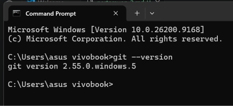
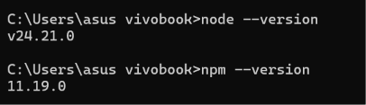

# **Praktikum mentiapkan memulai Pemrograman Mobile dengan React Native**
## **Tujuan Pembelajaran**
setelah menyelesaikan modul praktikum ini, mahasiswa diharapkan mampu:
- Menginstal Git dan Github
- Menginstal Node.js dan NPM
- Mengisntal Expo CLI
- Membuat project React Native
- menjalankan project React Native

1. Install Git di local
    - unduh dan Instal Git via  https://git-scm.com/install/windows 
    - Verifikasi git (buka cmd dan ketik “ git –version”)
    

2. Instal Node JS
    - unduh dan instal node JS via : https://nodejs.org/en/download
    - verifikasi Node JS (buka cmd dan ketik “node – version” “npm –version")
    

3. Memulai Projek dengan Framework Expo
    - Buka terminal pada code editor
    - Pastikan aktif di repository yang dituju
    - ketikan (npm create-expo-app ptmn2 -- template blank)
    - tunggu hingga proses install selesai
    - projek selesai
    
4. Menjalankan Projek React Native
    - Masuk ke directory projek (cd ptmn2)
    - Jalankan projek (npx expo start)
    - Scan QR Code dengan Aplikasi Expo Go
    - jika ingin run emulator di WEB ketik w
    - di terminal "npx expo install react-dom react-native-web"
    - npx expo start --web

5. Latihan pertemuan -2
    - Tambahkan text berupa
    - Nama Lengkap
    - Tempat Tanggal Lahir
    - Cita-Cita
    - Rencana Hidup
    

